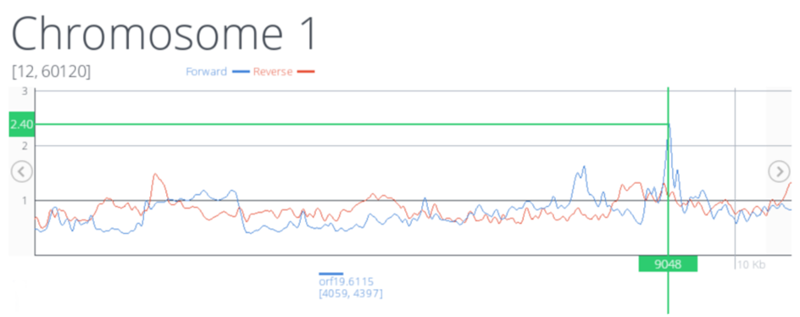

# TilingScan

**TilingScan** is an application for the identification of differentially expressed DNA regions in Tiling microarray data. You can use it on [tilingscan.uv.es](http://tilingscan.uv.es).

## Install a local copy of TilingScan

You can install **TilingScan** in your *localhost* and use it with your local data. For this, you need:

- Install **Apache** and enable the *mod_rewrite*.
- Install **PHP**, version 5.5.3 or higher.

If you have problems with the installation, please read the [Installation guide]().

## Support

If you have a technical problem with **TilingScan**, please contact with Jose M. in [www.jmjuanes.es](http://www.jmjuanes.es).

## License

Copyright 2014 Vicente Arnau, Jose Enrique Perez, Ana Miguel and Jose M. Juanes. All rights reserved.

**Universidad de Valencia**
